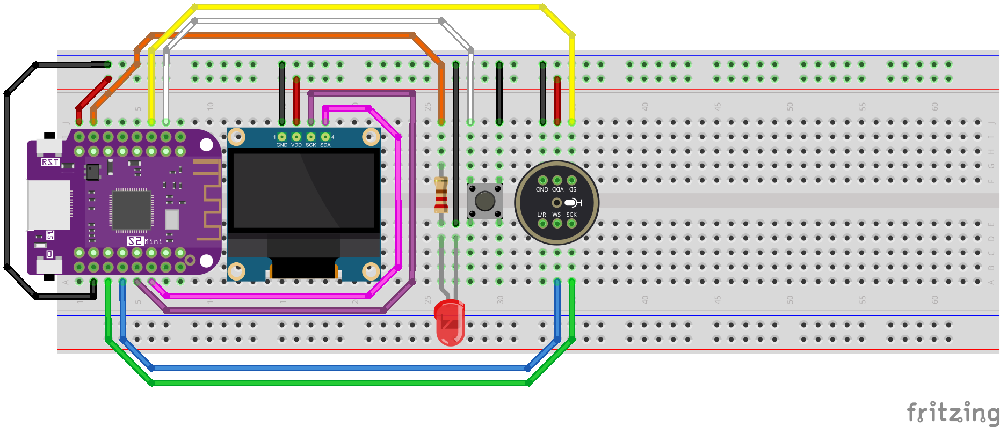

# TamAIgotchi
ESP32 based client for [LocalAI](https://localai.io/)

This is a basic demonstration on how an ESP32 with a digital microphone and oled display can act as frontend to LocalAI.
It can be compiled and installed using the Arduino IDE

## Required Parts

- ESP32 with PSRAM. For this project a LOLIN S2 Mini was used
- INMP441 I2S Microphone
- 0,96 Zoll OLED Display I2C 128 x 64

## Required Software

- [Arduino IDE](https://docs.arduino.cc/software/ide/)
- [Arduino-ESP32](https://docs.espressif.com/projects/arduino-esp32/en/latest/installing.html)

## Connection Diagram



## Installation

```
git clone https://github.com/a-i-a-d/TamAIgotchi.git
cd TamAIgotchi
arduino-ide TamAIgotchi/TamAIgotchi.ino
```

## Configuration

You have to edit config.h and enter your
- WiFi SSID
- WiFi Passkey
- LocalAI API url

in the first three lines:
```
const char* ssid = "SSID";
const char* password = "PASSWORD";
const char* api_url = "http://192\.168\.1\.5:8080/v1/";
```

Please make sure to escape dots (.) in the url string like in the example above.

## Required Libraries

To compile the program you'll need to install the following libraries in the Arduino IDE:
- Adafruit SSD1306

Additionally, you'll require a modified version of the OpenAI-ESP32 library that can be used with LocalAI:
- Download [LocalAI-ESP32 library](https://github.com/a-i-a-d/LocalAI-ESP32/archive/refs/tags/v0.0.1.zip)
- In the Arduino IDE got click Sketch->Include Library->Add .ZIP Library...
- Select the downloaded LocalAI-ESP32-0.0.1.zip file

## Compilation and Upload

- Connect your ESP32 board via USB
- Select the correct ESP32 board in the Arduino IDE
- Click the Compile and Upload button

## Usage

When you push the button, the LED lights up and the microphone will record 5 seconds of audio.
The audio recording is sent to your LocalAI whisper model and gets transcoded into a text.
The text then is sent as prompt to the LocalAI gpt4 model and the response is shown on the oled display.
